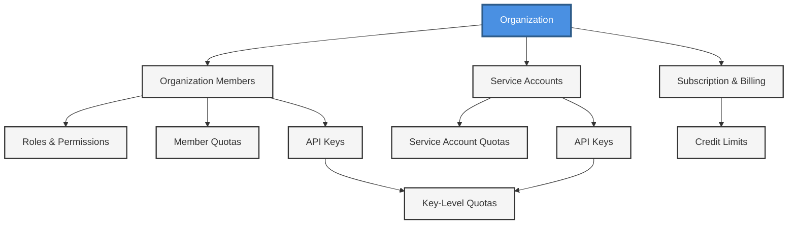

## Overview

Organizations in Compile Labs are your company/account boundary. They own billing, quotas, models, and deployments. Understanding how organizations, users, members, service accounts, and API keys work together is essential for effective access management.

## Core Concepts

### Organization

Your company/account boundary that:
- Owns billing, quotas, models, and deployments
- Can have multiple human users and multiple service accounts
- Has subscription and credit limits enforced at the org level
- Supports optional user/API key sub-limits

### User (Human)

A human identity that manages their own authentication:
- Can belong to one or more orgs
- Manages their own password, 2FA, email, and password recovery
- Authentication is handled individually by the user
- Never directly holds API keys; keys are scoped to an org member or service account

### Organization Member (Membership)

A user's role and limits within an org:
- Binds a `user_id` to an `organization_id` with a role (e.g., admin, member)
- Can have per-member quotas (credit limit, reset period) that inherit from the org when not set
- Supports lifecycle status (active/locked) and audit fields (who invited, when)

### Service Account

A non-human identity owned by the org:
- Used for automations, CI/CD, or server-to-server usage
- Appears as an org member but marked as `is_service_account`
- Holds API keys (one or many) for programmatic access without human authentication

### API Key

A credential to call the API on behalf of a member or service account:
- Scoped to the org and the specific member/service account
- Supports per-key quotas (credit limit, reset period); inherits from its owner when not set
- Rotatable and revocable without affecting other keys or users

## Organization Structure & Access Control



### High-Level Structure

**Organization**
- Contains billing, quotas, and resources
- Has multiple members (users) and service accounts
- Manages subscription and credit limits

**Users** 
- Manage their own password, 2FA, email, and password recovery
- Belong to organizations through memberships
- Have roles (Owner, Admin, Member)
- Can have member-level quotas

**Service Accounts**
- Non-human identities for automation
- Owned by the organization
- Can have service account-level quotas

**API Keys**
- Belong to either a user (via membership) or service account
- Can have key-level quotas
- Inherit quotas: Key → Member/SA → Organization

## How They Fit Together

- An org contains users via memberships; each membership defines role/permissions/quotas
- Service accounts are memberships too, but for automation
- API keys belong to a membership (human or service account), and are constrained by:
  - Key limit (if set) → Member limit (if set) → Org limit (unless org is postpaid)
- Usage is recorded in real time and batched; limits are enforced before provider calls to prevent overage

## Access Control and Quotas

### Roles and Permissions

- Enforced on org endpoints (e.g., only admins update others' quotas)
- Roles include: Owner, Admin, Member

### Quotas

When you make a request, we check quotas in this order: API key → Member → Org.

- Reset periods supported: daily, monthly, never. Lower levels inherit the reset period from their parent unless selected otherwise when configuring.
- If postpaid billing is enabled, the org limit can be effectively unlimited
- Key/member limits still apply if set

### Quota Hierarchy Example

```
Organization Credit Limit: $10,000/month
├── User A (Member) Credit Limit: $2,000/month
│   ├── API Key 1: $500/month
│   └── API Key 2: No limit (inherits from User A)
└── User B (Member) Credit Limit: None (inherits from Org)
    └── API Key 3: $1,500/month
```

### Error Codes

You'll receive clear error statuses:
- `api_key_credit_quota_exceeded` - API key limit reached
- `user_credit_quota_exceeded` - Member limit reached
- `organization_credit_quota_exceeded` - Organization limit reached

## Typical Patterns

### Human Integration

Users manage their own authentication; admins manage org roles and optional per-user credit limits.

### Server-to-Server

Use service accounts for workloads running in CI/CD or backend services. Service accounts provide programmatic access without human authentication.

## Operational Lifecycle

1. **Provision org** (subscription/credits)
2. **Add users** (invite or they join)
3. **Assign roles/quotas**
4. **Create service accounts** (optional)
5. **Issue API keys**
6. **Monitor usage** and adjust limits

## What to Use When

| Use Case | Recommended Approach |
|----------|---------------------|
| **Interactive apps or dashboards** | Human users + member-level quotas |
| **Backend jobs/agents** | Service accounts + API keys per environment or workload |
| **Granular cost controls** | Set per-key limits for fine-grained budgeting |
| **Guardrails** | Use member/org limits for safety nets |

## Usage Tracking

Track usage at multiple levels through your dashboard:
- Organization-level usage and credits
- User-specific usage and credits
- Service account usage
- API key usage

## Next Steps

<CardGroup cols={2}>

<Card title="Service Accounts" icon="key" href="/service-accounts">
Create and manage service accounts
</Card>

<Card title="API Keys" icon="key" href="/api-keys">
Manage API access
</Card>

<Card title="Billing" icon="credit-card" href="/billing">
Manage team billing
</Card>

<Card title="Quickstart" icon="rocket" href="/quickstart">
Get started with organizations
</Card>

</CardGroup>

